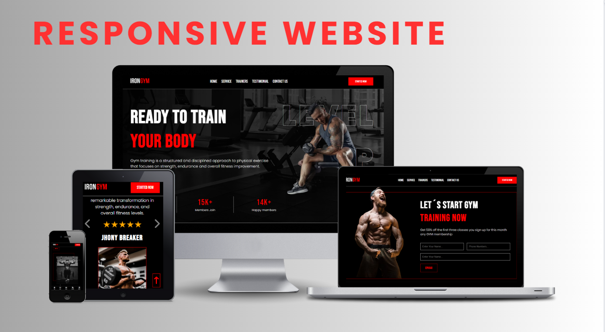

<h1 align="left">Gym Website</h1>

<h3 align="left">Experience seamless browsing on our responsive website crafted with HTML, CSS, and JavaScript. Our site adapts flawlessly to any device, providing an immersive user experience whether you're on a desktop, tablet, or smartphone. With smooth navigation and dynamic content, explore our offerings effortlessly and stay engaged with interactive features powered by JavaScript..</h3>

## 🌐 Socials:
 

## 💻 Tech Stack:
   

- 💻 This project is available at [https://resto-project-neon.vercel.app](https://gym-website-ebon.vercel.app)

- 👨‍💻 All of my projects are available at [https://enrique-spinelli-port.vercel.app](https://enrique-spinelli-port.vercel.app)

- 📫 How to reach me **enriquespinelli.coder@gmail.com**
